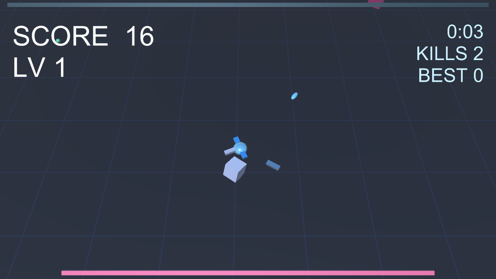

# 💥 Neon Swarm

> ドラッグで動き回り、自動射撃でネオンの大群をなぎ倒すウェーブサバイバー

見下ろし型のツインスティック・ウェーブサバイバー（Vampire Survivors ライク）です。ドラッグで移動し、自動射撃で押し寄せるネオンの大群をなぎ倒します。XP を集めてレベルアップし、アップグレードをドラフトして FRENZY コンボを積み重ねます。WebGL 製でモバイルにも対応しています。


🔗 **[Live Demo](https://masafykun.github.io/neon-swarm/)**

---

## 📸 スクリーンショット



---

## 🎮 操作方法

| 操作 | 動作 |
|---|---|
| ドラッグ | キャラクターを移動する |
| 射撃 | 自動射撃（操作不要） |
| レベルアップ | XP 取得時にアップグレードをドラフト選択 |

---

## ✨ 特徴

- **ツインスティック操作** — ドラッグで移動、攻撃は自動射撃
- **ウェーブサバイバー** — 押し寄せるネオンの大群を生き延びる
- **レベルアップ＆ドラフト** — XP を集めてアップグレードを選択
- **FRENZY コンボ** — コンボを積み重ねて火力を高める
- **モバイル対応** — WebGL 製でスマートフォンでも快適にプレイ可能

---

## 🛠️ 技術スタック

| カテゴリ | 技術 |
|---|---|
| ゲームエンジン | Unity 6000.0.77f1 |
| 言語 | C# |
| ビルド | WebGL |
| ホスティング | GitHub Pages |

---

## 🚀 セットアップ

```bash
# WebGL ビルド済みのため、ブラウザで直接プレイできます
# Live Demo: https://masafykun.github.io/neon-swarm/

# C# ソースは src/ 以下にあります
# Unity 6000.0.77f1 でプロジェクトを開いて編集・ビルドが可能です
```

---

© 2026 masafykun (https://github.com/masafykun)

---

## ライセンス

[](https://opensource.org/licenses/MIT)

このプロジェクトは **MIT ライセンス** のもとで公開しています。

© 2026 masafykun (https://github.com/masafykun)
